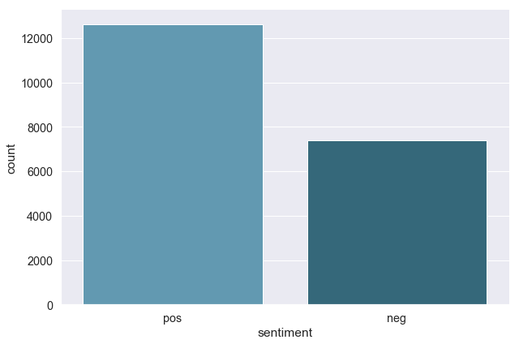
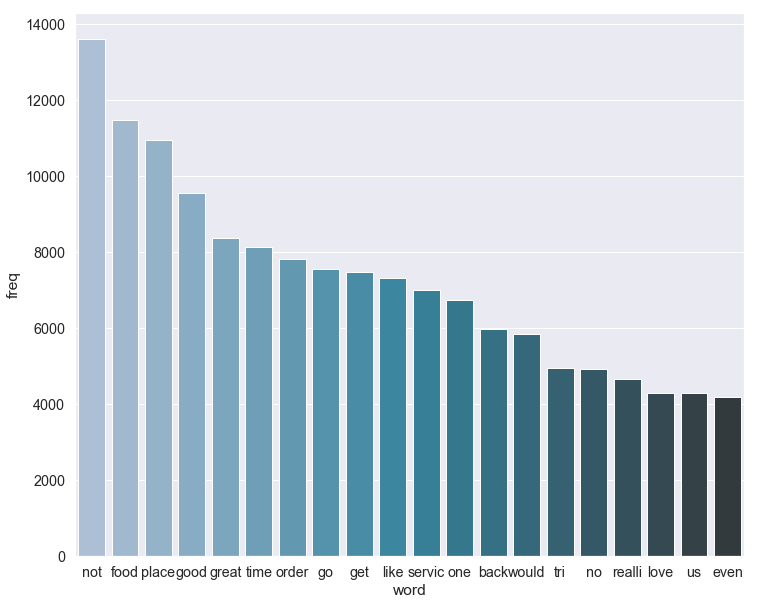

# CS229_proj
cs229 final project: sentiment analysis of restaurant reviews
- preprocessed dataset: `out.zip` 
- First attempt with naive bayes and svm: `milestone.py`
- Apple's CoreML framework: cs229_proj.mlproj
- EDA, data preprocessing, baseline models, hyper parameter tuning, stack model: `my_review.ipynb`
- LSTM+Attention: `yelp_lstm_att.ipynb`
- Results: `img.zip`
- 
### EDA

